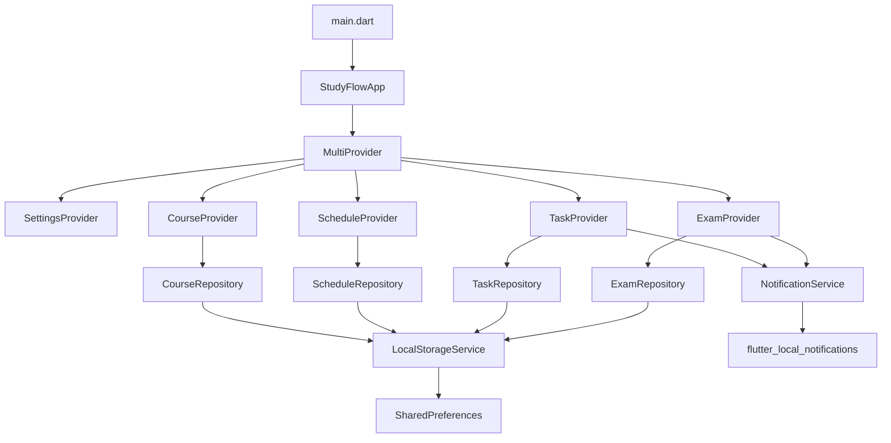
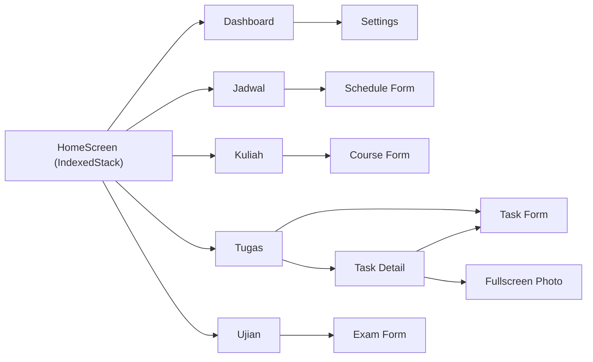

# 📚 Analisis Lengkap Aplikasi StudyFlow

## 1. Ringkasan Umum

**StudyFlow** adalah aplikasi manajemen akademik berbasis Flutter yang dirancang untuk mahasiswa. Aplikasi ini membantu pengguna mengatur mata kuliah, jadwal perkuliahan, tugas, dan ujian dalam satu tempat. Versi saat ini: **2.0.0+1**.

| Aspek | Detail |
|---|---|
| Framework | Flutter (Dart SDK ≥3.0.0 <4.0.0) |
| State Management | `provider` ^6.1.2 |
| Penyimpanan Lokal | `shared_preferences` ^2.3.2 |
| Notifikasi | `flutter_local_notifications` ^17.2.4 + `timezone` ^0.9.4 |
| Bahasa UI | Bahasa Indonesia |
| Target Platform | Android (utama), iOS, Web, Windows, Linux, macOS |
| Design System | Material Design 3 (Material You) |

---

## 2. Arsitektur Aplikasi

Aplikasi menggunakan arsitektur **feature-first** dengan pola **Repository Pattern** dan **Provider** untuk state management.



### Alur Data
1. **UI (Screen/Widget)** → memanggil method di **Provider**
2. **Provider** → memanggil **Repository** untuk CRUD + **NotificationService** untuk scheduling
3. **Repository** → membaca/menulis via **LocalStorageService**
4. **LocalStorageService** → wrapper di atas `SharedPreferences` (JSON encode/decode)

---

## 3. Struktur Folder

```text
lib/
├── main.dart                          # Entry point, inisialisasi storage & notif
├── app/
│   ├── app.dart                       # Root widget, MultiProvider, theming, HomeScreen
│   └── routes.dart                    # Definisi named routes (belum aktif dipakai)
├── core/
│   ├── models/
│   │   ├── course.dart                # Model Mata Kuliah
│   │   ├── schedule.dart              # Model Jadwal Kuliah
│   │   ├── task.dart                  # Model Tugas
│   │   └── exam.dart                  # Model Ujian
│   ├── services/
│   │   ├── local_storage_service.dart # Abstraksi SharedPreferences
│   │   └── notification_service.dart  # Scheduling notifikasi lokal
│   └── utils/
│       ├── constants.dart             # Konstanta global (keys, label, warna)
│       └── date_utils.dart            # Formatter & kalkulasi tanggal
├── features/
│   ├── dashboard/
│   │   ├── screens/dashboard_screen.dart
│   │   └── widgets/ (stat_card, task_progress, today_schedule, upcoming)
│   ├── course/
│   │   ├── providers/course_provider.dart
│   │   ├── repositories/course_repository.dart
│   │   ├── screens/ (course_screen, course_form_screen)
│   │   └── widgets/course_card.dart
│   ├── schedule/
│   │   ├── providers/schedule_provider.dart
│   │   ├── repositories/schedule_repository.dart
│   │   ├── screens/ (schedule_screen, schedule_form_screen)
│   │   └── widgets/schedule_card.dart
│   ├── task/
│   │   ├── providers/task_provider.dart
│   │   ├── repositories/task_repository.dart
│   │   ├── screens/ (task_screen, task_form_screen, task_detail_screen)
│   │   └── widgets/ (task_card, image_picker_widget)
│   ├── exam/
│   │   ├── providers/exam_provider.dart
│   │   ├── repositories/exam_repository.dart
│   │   ├── screens/ (exam_screen, exam_form_screen)
│   │   └── widgets/exam_card.dart
│   └── settings/
│       ├── setting_provider.dart
│       └── setting_screen.dart
└── shared/
    └── widgets/
        ├── app_bottom_nav.dart        # Bottom NavigationBar (5 tab)
        ├── color_picker_widget.dart    # Pilihan warna untuk mata kuliah
        └── empty_state_widget.dart    # Placeholder saat data kosong
```

**Total: ~40 file Dart**

---

## 4. Detail Setiap Fitur

### 4.1 Dashboard (`features/dashboard/`)

Halaman utama yang menampilkan ringkasan keseluruhan:

| Komponen | Deskripsi |
|---|---|
| **Header** | Sapaan dinamis (pagi/siang/sore/malam) + nama user + tanggal hari ini |
| **Stat Cards** | 4 kartu: Total SKS, Tugas pending, Ujian mendatang, Jadwal hari ini |
| **Jadwal Hari Ini** | Daftar kuliah hari ini dengan indikator "Berlangsung" secara real-time |
| **Progress Tugas** | Progress bar keseluruhan + breakdown per mata kuliah |
| **Ujian Mendatang** | Maks 3 ujian terdekat dengan countdown hari |

- Avatar user di pojok kanan atas yang mengarah ke halaman **Settings**.
- Menggunakan `CustomScrollView` + `SliverToBoxAdapter` untuk scrollable layout.

---

### 4.2 Mata Kuliah (`features/course/`)

**Model `Course`:**
| Field | Tipe | Keterangan |
|---|---|---|
| `id` | String (UUID) | Primary key |
| `name` | String | Nama mata kuliah |
| `sks` | int | Jumlah SKS |
| `lecturer` | String | Nama dosen |
| `room` | String | Ruangan default |
| `color` | Color | Warna identitas (dari 10 pilihan preset) |

**Fitur:**
- CRUD lengkap mata kuliah
- Chip total SKS di AppBar
- Hapus mata kuliah = cascade delete jadwal, tugas, dan ujian terkait
- Inisial otomatis dari nama (misal "Pemrograman Mobile" → "PM")
- Color picker dengan 10 warna preset + animasi seleksi

---

### 4.3 Jadwal Kuliah (`features/schedule/`)

**Model `Schedule`:**
| Field | Tipe | Keterangan |
|---|---|---|
| `id` | String (UUID) | Primary key |
| `courseId` | String | Relasi ke Course |
| `day` | int | 0=Senin, 6=Minggu |
| `startTime` | TimeOfDay | Jam mulai |
| `endTime` | TimeOfDay | Jam selesai |
| `room` | String | Ruangan |

**Fitur:**
- Tampilan per hari dengan **Day Selector** (ChoiceChip horizontal)
- Default membuka hari ini
- Indikator titik untuk hari ini pada chip yang tidak dipilih
- Card dengan color bar kiri sesuai warna mata kuliah
- Sorting otomatis berdasarkan jam mulai

---

### 4.4 Tugas (`features/task/`)

**Model `Task`:**
| Field | Tipe | Keterangan |
|---|---|---|
| `id` | String (UUID) | Primary key |
| `courseId` | String | Relasi ke Course |
| `title` | String | Judul tugas |
| `description` | String | Deskripsi opsional |
| `deadline` | DateTime | Tanggal deadline |
| `deadlineTime` | TimeOfDay? | Jam deadline (opsional, default 23:59) |
| `priority` | int | 1=Rendah, 2=Sedang, 3=Tinggi |
| `isDone` | bool | Status selesai |
| `imagePath` | String? | Path foto tugas (dari kamera/galeri) |

**Fitur:**
- **Task List** dengan checkbox bulat untuk toggle selesai
- **Task Detail Screen** dengan foto full-width + Hero animation + pinch-to-zoom
- **Task Form** dengan deadline picker (tanggal + jam opsional), priority selector (SegmentedButton), dan image picker
- **Deadline Preview** real-time di form (warna merah jika terlewat, oranye jika dekat)
- Toggle tampilkan/sembunyikan tugas yang sudah selesai
- Hapus dengan konfirmasi dialog
- Sorting otomatis: tugas pending diurutkan berdasarkan deadline terdekat

**Image Picker:**
- Bottom sheet pilih sumber: Kamera atau Galeri
- Kompresi otomatis (quality 80, max width 1920px)
- File disalin ke `app_documents/task_images/` agar persisten
- Preview dengan overlay tombol Ganti/Hapus
- Error handler jika file foto tidak ditemukan

---

### 4.5 Ujian (`features/exam/`)

**Model `Exam`:**
| Field | Tipe | Keterangan |
|---|---|---|
| `id` | String (UUID) | Primary key |
| `courseId` | String | Relasi ke Course |
| `title` | String | Jenis (UTS/UAS/Kuis) |
| `date` | DateTime | Tanggal ujian |
| `time` | TimeOfDay | Jam ujian |
| `room` | String | Ruangan |
| `notes` | String | Catatan tambahan |

**Fitur:**
- Daftar ujian mendatang dengan countdown bubble (tanggal + bulan)
- Highlight merah untuk ujian dalam 7 hari
- CRUD lengkap via ExamFormScreen
- Badge jenis ujian (UTS/UAS/Kuis) dengan warna mata kuliah

---

### 4.6 Pengaturan (`features/settings/`)

**Fitur:**
| Pengaturan | Deskripsi |
|---|---|
| **Profil** | Nama user (ditampilkan di Dashboard), editable inline |
| **Tema** | Ikuti Sistem / Terang / Gelap (tersimpan persisten) |
| **Info** | Versi aplikasi (2.0.0), nama & deskripsi app |

---

### 4.7 Sistem Notifikasi (`core/services/notification_service.dart`)

Sistem notifikasi yang paling kompleks di aplikasi ini. Menggunakan `flutter_local_notifications` + `timezone` untuk penjadwalan exact alarm.

**Timezone Handling:**
- Auto-detect zona waktu Indonesia berdasarkan offset: WIB (Asia/Jakarta), WITA (Asia/Makassar), WIT (Asia/Jayapura)

**Notifikasi Tugas (berbasis prioritas):**

| Prioritas | Jadwal Notifikasi |
|---|---|
| Rendah (1) | H-1 jam 08:00 |
| Sedang (2) | H-3, H-2, H-1, H-0 masing-masing jam 08:00 |
| Tinggi (3) | H-6 sampai H-0 (setiap hari jam 08:00) + 1 jam sebelum deadline |

**Notifikasi Ujian:**
- H-1 pada jam yang sama dengan ujian
- 1 jam sebelum ujian dimulai

**ID Management:**
- Exam range: `10000..19999` (1000 item × 10 slot)
- Task range: `20000..29999` (1000 item × 10 slot)
- Collision diminimalisir dengan `hashCode.abs() % 1000 * slotsPerItem`

**Lifecycle:**
- Notifikasi dijadwalkan saat task/exam dibuat atau diupdate
- Notifikasi dibatalkan saat task selesai, dihapus, atau mata kuliah dihapus
- Skip otomatis untuk waktu yang sudah lewat

---

## 5. Penyimpanan Data

Semua data disimpan di **SharedPreferences** sebagai JSON string.

| Key | Data |
|---|---|
| `sf_courses` | List JSON mata kuliah |
| `sf_schedules` | List JSON jadwal |
| `sf_tasks` | List JSON tugas |
| `sf_exams` | List JSON ujian |
| `sf_theme_mode` | bool (dark/light) |
| `sf_use_system_theme` | bool |
| `sf_user_name` | String |

---

## 6. Navigasi Aplikasi



- Navigasi utama: **NavigationBar** (Material 3) dengan 5 tab
- `IndexedStack` menjaga state setiap tab tetap hidup
- Navigasi antar screen menggunakan `Navigator.push` (bukan named routes)

---

## 7. Theming

- **Material 3** dengan `ColorScheme.fromSeed`
- Seed color: `#4D9FEC` (biru muda)
- Mendukung Light Mode dan Dark Mode
- `debugShowCheckedModeBanner: false`

---

## 8. Dependencies

| Package | Versi | Fungsi |
|---|---|---|
| `provider` | ^6.1.2 | State management |
| `shared_preferences` | ^2.3.2 | Penyimpanan key-value lokal |
| `flutter_local_notifications` | ^17.2.4 | Notifikasi lokal terjadwal |
| `intl` | ^0.19.0 | Format tanggal Bahasa Indonesia |
| `uuid` | ^4.4.0 | Generate ID unik |
| `timezone` | ^0.9.4 | Akurasi zona waktu untuk notif |
| `image_picker` | ^1.1.2 | Ambil foto dari kamera/galeri |
| `path_provider` | ^2.1.4 | Akses direktori app documents |
| `path` | ^1.9.0 | Manipulasi path file |
| `table_calendar` | ^3.1.2 | *(Terdaftar tapi belum digunakan di UI)* |

---

## 9. Kekuatan Aplikasi Saat Ini

1. **Arsitektur bersih** — Pemisahan jelas antara UI, Provider, Repository, dan Service
2. **Notifikasi canggih** — Berbasis prioritas dengan timezone-aware scheduling
3. **UX yang baik** — Empty states, konfirmasi hapus, indicator "berlangsung", deadline countdown
4. **Offline-first** — Semua data lokal, tidak butuh internet
5. **Material 3** — Desain modern dan konsisten
6. **Foto tugas** — Fitur upload foto dengan kompresi dan persistent storage

---

## 10. Kelemahan & Potensi Masalah

| # | Masalah | Dampak |
|---|---|---|
| 1 | SharedPreferences untuk data besar | Lambat jika data banyak (100+ item), risiko corrupt |
| 2 | `routes.dart` didefinisikan tapi tidak digunakan | Dead code |
| 3 | `table_calendar` di pubspec tapi tidak dipakai | Menambah ukuran APK tanpa manfaat |
| 4 | Tidak ada unit test | Risiko regresi tinggi |
| 5 | Cascade delete mata kuliah tidak transaksional | Bisa partial delete jika error di tengah |
| 6 | Notification ID collision | `hashCode % 1000` bisa bentrok jika banyak item |
| 7 | Tidak ada fitur backup/restore | Data hilang jika reinstall |
| 8 | Foto tugas tidak di-cleanup saat task dihapus | File orphan menumpuk di storage |

---

## 11. Saran Pengembangan Lebih Lanjut

### 🔴 Prioritas Tinggi (Sebaiknya Segera)

#### 1. Migrasi ke SQLite (sqflite / drift)
SharedPreferences tidak dirancang untuk data relasional besar. Migrasi ke SQLite akan memberikan:
- Query yang lebih cepat dan efisien
- Relasi data yang proper (foreign key)
- Transaksi atomik (cascade delete yang aman)
- Dukungan untuk fitur search dan filter yang kompleks

#### 2. Backup & Restore Data
Tambahkan fitur ekspor/impor data ke file JSON agar:
- Data aman saat reinstall atau ganti HP
- Bisa share data antar perangkat
- Implementasi: ekspor ke JSON → simpan ke Downloads / share via intent

#### 3. Cleanup File Foto Orphan
Saat task dihapus, file foto di `task_images/` tidak ikut dihapus. Tambahkan logic untuk menghapus file fisik saat task dihapus.

#### 4. Hapus Dead Code
- Hapus `routes.dart` yang tidak digunakan, atau migrasikan navigasi ke named routes
- Hapus dependency `table_calendar` jika tidak dipakai

---

### 🟡 Prioritas Sedang (Fitur Berguna)

#### 5. Fitur Pencarian & Filter
- Search tugas/ujian berdasarkan judul
- Filter tugas berdasarkan mata kuliah atau prioritas
- Filter ujian berdasarkan jenis (UTS/UAS/Kuis)

#### 6. Tampilan Kalender
- Manfaatkan `table_calendar` yang sudah ada di pubspec
- Tampilkan deadline tugas dan jadwal ujian di kalender visual
- View bulanan dengan dot indicator untuk hari yang ada event

#### 7. Statistik & Analitik
- Grafik penyelesaian tugas per minggu/bulan
- Rata-rata waktu penyelesaian tugas
- Distribusi prioritas tugas
- Total SKS per semester

#### 8. Recurring Schedule Notification
- Notifikasi pengingat kuliah harian (misal: "Kuliah Matematika 30 menit lagi")
- Saat ini jadwal kuliah hanya tampil di UI, tidak ada notifikasi

#### 9. Catatan Perkuliahan
- Tambahkan fitur catatan/notes per mata kuliah
- Support rich text atau markdown sederhana
- Lampiran file (PDF, gambar)

---

### 🟢 Prioritas Rendah (Nice to Have)

#### 10. Onboarding Screen
- Tampilan tutorial pertama kali buka aplikasi
- Panduan cara menambah mata kuliah, jadwal, dll
- Permintaan izin notifikasi yang lebih user-friendly

#### 11. Multi-Semester Support
- Arsip semester lama
- Ganti semester aktif tanpa kehilangan data sebelumnya
- Ringkasan per semester (total SKS, total tugas, dsb.)

#### 12. Widget Home Screen Android
- Glance widget menampilkan tugas terdekat dan jadwal hari ini
- Quick action untuk menandai tugas selesai langsung dari home screen

#### 13. Sinkronisasi Cloud (Firebase / Supabase)
- Login dengan Google Account
- Sync data antar perangkat
- Backup otomatis ke cloud

#### 14. Kolaborasi Grup
- Buat grup per kelas/mata kuliah
- Share jadwal dan info tugas/ujian sesama mahasiswa
- Notifikasi jika ada update dari teman sekelas

#### 15. Dark Mode Scheduling
- Otomatis dark mode pada jam tertentu (misal 18:00–06:00)
- Terpisah dari pengaturan sistem

#### 16. Integrasi Akademik
- Import jadwal dari SIAKAD kampus (jika ada API)
- Kalkulasi IP/IPK otomatis dengan input nilai

#### 17. Pomodoro Timer
- Timer fokus belajar (25 menit kerja, 5 menit istirahat)
- Integrasi dengan tugas — "Belajar untuk tugas X"
- Statistik waktu belajar

#### 18. Localization
- Dukungan multi-bahasa (Indonesia + English)
- Menggunakan `flutter_localizations` + ARB files

---

## 12. Ringkasan Statistik Codebase

| Metrik | Jumlah |
|---|---|
| Total file Dart | ~40 |
| Model data | 4 (Course, Schedule, Task, Exam) |
| Provider | 5 (Course, Schedule, Task, Exam, Settings) |
| Repository | 4 (Course, Schedule, Task, Exam) |
| Service | 2 (LocalStorage, Notification) |
| Screen | 10 (Dashboard, Course×2, Schedule×2, Task×3, Exam×2, Settings) |
| Shared Widget | 3 (BottomNav, ColorPicker, EmptyState) |
| Feature Widget | 8 (StatCard, TaskProgress, TodaySchedule, Upcoming, CourseCard, ScheduleCard, TaskCard, ExamCard, ImagePicker) |
| Dependencies | 9 packages |
