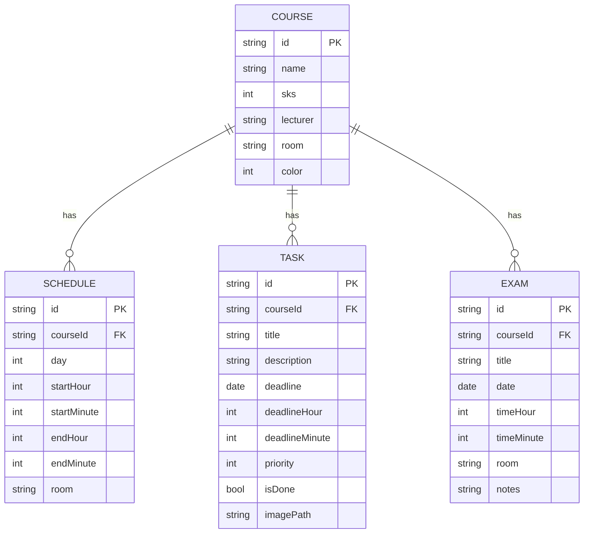
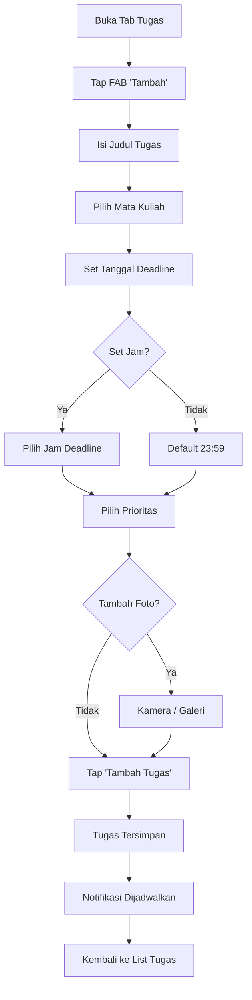
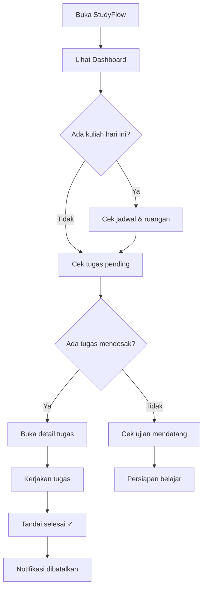

# 📄 Product Requirements Document (PRD)
# StudyFlow — Aplikasi Manajemen Akademik Mahasiswa

| Informasi | Detail |
|---|---|
| **Nama Produk** | StudyFlow |
| **Versi Dokumen** | 1.0 |
| **Versi Aplikasi** | 2.0.0 |
| **Tanggal** | 30 April 2026 |
| **Platform** | Android (utama), iOS (sekunder) |
| **Teknologi** | Flutter / Dart |

---

## 1. Ringkasan Eksekutif

**StudyFlow** adalah aplikasi mobile yang dirancang untuk membantu mahasiswa mengelola seluruh kegiatan akademik mereka — mulai dari jadwal kuliah, tugas, hingga ujian — dalam satu platform yang terintegrasi. Aplikasi ini menyediakan sistem pengingat cerdas berbasis prioritas yang memastikan mahasiswa tidak pernah melewatkan deadline penting.

### Masalah yang Diselesaikan

Mahasiswa sering menghadapi kesulitan dalam:
1. **Melacak banyak deadline** dari berbagai mata kuliah secara bersamaan
2. **Mengingat jadwal kuliah** yang berubah-ubah setiap hari
3. **Memprioritaskan tugas** ketika semua terasa mendesak
4. **Mengingat jadwal ujian** yang jaraknya berbulan-bulan dari hari pengumuman

### Solusi

StudyFlow memberikan **satu dashboard terpusat** yang menampilkan ringkasan harian, progress tugas, dan countdown ujian, dilengkapi dengan **notifikasi otomatis** yang frekuensinya disesuaikan dengan tingkat urgensi setiap item.

---

## 2. Visi & Misi Produk

### Visi
> Menjadi aplikasi pendamping akademik #1 bagi mahasiswa Indonesia yang membuat pengelolaan jadwal dan tugas kuliah terasa mudah, terorganisir, dan bebas stres.

### Misi
1. Menyederhanakan manajemen akademik mahasiswa dalam satu aplikasi
2. Mengurangi risiko terlewatnya deadline melalui notifikasi cerdas
3. Memberikan gambaran visual progress akademik secara real-time
4. Bekerja sepenuhnya offline tanpa ketergantungan internet

---

## 3. Target Pengguna

### 3.1 Persona Utama

#### 👤 Andi — Mahasiswa Aktif
| Aspek | Detail |
|---|---|
| **Usia** | 19–23 tahun |
| **Pendidikan** | Mahasiswa S1 semester 3–7 |
| **Perangkat** | Smartphone Android (mid-range) |
| **Kebutuhan** | Mengatur 6–8 mata kuliah per semester, 15+ tugas aktif |
| **Pain Point** | Sering lupa deadline karena hanya mengandalkan ingatan atau catatan manual |
| **Motivasi** | Ingin lebih terorganisir agar IPK meningkat |

#### 👤 Sari — Mahasiswa Sibuk
| Aspek | Detail |
|---|---|
| **Usia** | 20–24 tahun |
| **Pendidikan** | Mahasiswa S1 semester akhir |
| **Perangkat** | Smartphone Android/iOS |
| **Kebutuhan** | Memantau tugas skripsi + kuliah reguler + kegiatan organisasi |
| **Pain Point** | Kewalahan dengan banyaknya deadline yang bertumpuk |
| **Motivasi** | Butuh sistem yang mengingatkan secara otomatis tanpa harus buka aplikasi |

### 3.2 Segmentasi Pasar

- **Geografi**: Indonesia (UI berbahasa Indonesia, timezone WIB/WITA/WIT)
- **Demografi**: Mahasiswa perguruan tinggi aktif (D3/S1/S2)
- **Psikografi**: Digital-savvy, mengandalkan smartphone untuk produktivitas harian

---

## 4. User Stories

### 4.1 Mata Kuliah

| ID | Sebagai | Saya ingin | Agar |
|---|---|---|---|
| US-01 | Mahasiswa | Menambahkan mata kuliah beserta SKS, dosen, dan ruangan | Data mata kuliah tersimpan rapi |
| US-02 | Mahasiswa | Memberikan warna unik untuk setiap mata kuliah | Mudah membedakan mata kuliah di jadwal & tugas |
| US-03 | Mahasiswa | Mengedit informasi mata kuliah | Data tetap akurat jika ada perubahan |
| US-04 | Mahasiswa | Menghapus mata kuliah beserta semua data terkait | Semester baru bisa dimulai bersih |
| US-05 | Mahasiswa | Melihat total SKS yang diambil | Memastikan beban kuliah tidak berlebihan |

### 4.2 Jadwal Kuliah

| ID | Sebagai | Saya ingin | Agar |
|---|---|---|---|
| US-06 | Mahasiswa | Menambah jadwal per hari per mata kuliah | Tahu kapan dan dimana harus kuliah |
| US-07 | Mahasiswa | Melihat jadwal kuliah berdasarkan hari | Persiapan kuliah hari ini/besok lebih mudah |
| US-08 | Mahasiswa | Melihat kuliah yang sedang berlangsung | Tahu kuliah apa yang sedang berjalan |
| US-09 | Mahasiswa | Mengedit dan menghapus jadwal kuliah | Menyesuaikan jika ada perubahan dari kampus |

### 4.3 Tugas

| ID | Sebagai | Saya ingin | Agar |
|---|---|---|---|
| US-10 | Mahasiswa | Menambah tugas dengan deadline, prioritas, dan deskripsi | Semua tugas tercatat dengan detail |
| US-11 | Mahasiswa | Mengatur jam deadline spesifik (opsional) | Tugas yang di-submit online jam tertentu bisa diatur |
| US-12 | Mahasiswa | Melampirkan foto tugas | Dokumentasi soal/instruksi tugas tersimpan |
| US-13 | Mahasiswa | Menandai tugas sebagai selesai | Tracking progress tugas |
| US-14 | Mahasiswa | Melihat sisa waktu deadline secara real-time | Tahu mana yang paling urgent |
| US-15 | Mahasiswa | Melihat detail tugas termasuk foto full-screen | Review instruksi tugas dengan mudah |
| US-16 | Mahasiswa | Menyembunyikan/menampilkan tugas yang sudah selesai | Fokus pada yang belum dikerjakan |
| US-17 | Mahasiswa | Menerima notifikasi otomatis sebelum deadline | Tidak pernah terlewat deadline |

### 4.4 Ujian

| ID | Sebagai | Saya ingin | Agar |
|---|---|---|---|
| US-18 | Mahasiswa | Menambah jadwal ujian (UTS/UAS/Kuis) | Semua ujian tercatat rapi |
| US-19 | Mahasiswa | Melihat ujian mendatang dengan countdown | Persiapan belajar lebih terencana |
| US-20 | Mahasiswa | Menerima notifikasi H-1 dan 1 jam sebelum ujian | Tidak lupa jadwal ujian |
| US-21 | Mahasiswa | Mengedit dan menghapus jadwal ujian | Menyesuaikan jika ada perubahan |

### 4.5 Dashboard & Pengaturan

| ID | Sebagai | Saya ingin | Agar |
|---|---|---|---|
| US-22 | Mahasiswa | Melihat ringkasan harian di satu halaman | Overview cepat tanpa buka banyak tab |
| US-23 | Mahasiswa | Melihat progress tugas per mata kuliah | Tahu mana yang paling banyak belum dikerjakan |
| US-24 | Mahasiswa | Mengatur nama profil saya | Dashboard terasa personal |
| US-25 | Mahasiswa | Memilih tema terang/gelap/sistem | Nyaman digunakan di berbagai kondisi cahaya |

---

## 5. Functional Requirements

### FR-01: Manajemen Mata Kuliah

| Req ID | Deskripsi | Prioritas |
|---|---|---|
| FR-01.1 | Sistem harus memungkinkan CRUD mata kuliah (nama, SKS, dosen, ruangan, warna) | Must Have |
| FR-01.2 | Sistem harus menampilkan total SKS dari semua mata kuliah | Must Have |
| FR-01.3 | Saat mata kuliah dihapus, semua jadwal, tugas, dan ujian terkait ikut dihapus | Must Have |
| FR-01.4 | Sistem menyediakan 10 pilihan warna preset untuk identitas mata kuliah | Must Have |
| FR-01.5 | Sistem men-generate inisial otomatis dari nama mata kuliah | Should Have |

### FR-02: Manajemen Jadwal Kuliah

| Req ID | Deskripsi | Prioritas |
|---|---|---|
| FR-02.1 | Sistem harus memungkinkan CRUD jadwal kuliah (hari, jam mulai, jam selesai, ruangan) | Must Have |
| FR-02.2 | Jadwal harus terkait ke mata kuliah yang sudah ada | Must Have |
| FR-02.3 | Tampilan jadwal harus bisa difilter per hari (Senin–Minggu) | Must Have |
| FR-02.4 | Default tampilan mengarah ke hari ini | Should Have |
| FR-02.5 | Jadwal yang sedang berlangsung harus diberi indikator visual real-time | Should Have |
| FR-02.6 | Jadwal harus diurutkan berdasarkan jam mulai | Must Have |

### FR-03: Manajemen Tugas

| Req ID | Deskripsi | Prioritas |
|---|---|---|
| FR-03.1 | Sistem harus memungkinkan CRUD tugas (judul, deskripsi, mata kuliah, deadline, prioritas) | Must Have |
| FR-03.2 | Deadline harus support tanggal + jam opsional (default 23:59) | Must Have |
| FR-03.3 | Prioritas tugas: Rendah (1), Sedang (2), Tinggi (3) | Must Have |
| FR-03.4 | User bisa melampirkan foto tugas dari kamera atau galeri | Should Have |
| FR-03.5 | Foto disimpan secara permanen di app storage dengan kompresi (quality 80, max 1920px) | Should Have |
| FR-03.6 | User bisa menandai tugas selesai/belum selesai (toggle) | Must Have |
| FR-03.7 | Tugas pending harus diurutkan berdasarkan deadline terdekat | Must Have |
| FR-03.8 | User bisa toggle tampilkan/sembunyikan tugas selesai | Should Have |
| FR-03.9 | Halaman detail tugas menampilkan foto full-width dengan zoom (pinch-to-zoom) | Could Have |
| FR-03.10 | Sisa waktu deadline ditampilkan real-time (jam/hari/terlewat) | Must Have |

### FR-04: Manajemen Ujian

| Req ID | Deskripsi | Prioritas |
|---|---|---|
| FR-04.1 | Sistem harus memungkinkan CRUD ujian (jenis, tanggal, jam, ruangan, catatan) | Must Have |
| FR-04.2 | Ujian harus terkait ke mata kuliah yang sudah ada | Must Have |
| FR-04.3 | Daftar ujian hanya menampilkan ujian mendatang (≥ hari ini - 1) | Must Have |
| FR-04.4 | Ujian dalam 7 hari harus diberi highlight visual (warning) | Should Have |
| FR-04.5 | Ujian diurutkan berdasarkan tanggal terdekat | Must Have |

### FR-05: Sistem Notifikasi

| Req ID | Deskripsi | Prioritas |
|---|---|---|
| FR-05.1 | Notifikasi tugas prioritas Rendah: H-1 (jam 08:00) | Must Have |
| FR-05.2 | Notifikasi tugas prioritas Sedang: H-3, H-2, H-1, H-0 (jam 08:00) | Must Have |
| FR-05.3 | Notifikasi tugas prioritas Tinggi: H-6 s/d H-0 (jam 08:00) + 1 jam sebelum deadline | Must Have |
| FR-05.4 | Notifikasi ujian: H-1 (jam sama dgn ujian) + 1 jam sebelum ujian | Must Have |
| FR-05.5 | Notifikasi otomatis dibatalkan saat tugas ditandai selesai | Must Have |
| FR-05.6 | Notifikasi di-reschedule saat tugas/ujian diupdate | Must Have |
| FR-05.7 | Sistem meminta izin notifikasi dan exact alarm (Android 13+) | Must Have |
| FR-05.8 | Timezone auto-detect: WIB, WITA, WIT | Must Have |
| FR-05.9 | Notifikasi yang waktunya sudah lewat di-skip otomatis | Must Have |

### FR-06: Dashboard

| Req ID | Deskripsi | Prioritas |
|---|---|---|
| FR-06.1 | Dashboard menampilkan sapaan dinamis berdasarkan waktu | Should Have |
| FR-06.2 | Menampilkan 4 stat cards: Total SKS, Tugas pending, Ujian mendatang, Jadwal hari ini | Must Have |
| FR-06.3 | Menampilkan jadwal kuliah hari ini dengan indikator "Berlangsung" | Must Have |
| FR-06.4 | Menampilkan progress tugas keseluruhan + per mata kuliah (progress bar) | Must Have |
| FR-06.5 | Menampilkan maks 3 ujian terdekat di section "Ujian Mendatang" | Should Have |
| FR-06.6 | Avatar user yang mengarah ke halaman Settings | Should Have |

### FR-07: Pengaturan

| Req ID | Deskripsi | Prioritas |
|---|---|---|
| FR-07.1 | User bisa mengatur nama profil (inline edit) | Should Have |
| FR-07.2 | User bisa memilih tema: Ikuti Sistem / Terang / Gelap | Must Have |
| FR-07.3 | Preferensi tema tersimpan persisten | Must Have |
| FR-07.4 | Menampilkan versi aplikasi dan informasi app | Could Have |

---

## 6. Non-Functional Requirements

### NFR-01: Performa

| Req ID | Deskripsi | Target |
|---|---|---|
| NFR-01.1 | Cold start time | < 3 detik pada perangkat mid-range |
| NFR-01.2 | Navigasi antar tab | < 100ms (instant feel, IndexedStack) |
| NFR-01.3 | Simpan/load data | < 500ms untuk 100 item |
| NFR-01.4 | Ukuran APK | < 25 MB (release) |

### NFR-02: Ketersediaan & Reliabilitas

| Req ID | Deskripsi |
|---|---|
| NFR-02.1 | Aplikasi berfungsi 100% offline |
| NFR-02.2 | Data persisten setelah restart aplikasi |
| NFR-02.3 | Notifikasi tetap terkirim meski aplikasi ditutup (exact alarm) |
| NFR-02.4 | Error handling pada semua operasi notifikasi (try-catch) |

### NFR-03: Kompatibilitas

| Req ID | Deskripsi |
|---|---|
| NFR-03.1 | Support Android API 21+ (Android 5.0 Lollipop ke atas) |
| NFR-03.2 | Support Android 13+ notification permission model |
| NFR-03.3 | Support 3 zona waktu Indonesia (WIB, WITA, WIT) |
| NFR-03.4 | Responsive layout pada berbagai ukuran layar Android |

### NFR-04: Usability

| Req ID | Deskripsi |
|---|---|
| NFR-04.1 | UI dalam Bahasa Indonesia |
| NFR-04.2 | Material Design 3 untuk konsistensi visual |
| NFR-04.3 | Empty state informatif pada setiap list kosong |
| NFR-04.4 | Konfirmasi dialog untuk semua aksi destruktif (hapus) |
| NFR-04.5 | Feedback visual setelah setiap aksi (SnackBar, animasi) |

### NFR-05: Keamanan & Privasi

| Req ID | Deskripsi |
|---|---|
| NFR-05.1 | Tidak mengumpulkan data pengguna ke server manapun |
| NFR-05.2 | Semua data tersimpan di lokal perangkat pengguna |
| NFR-05.3 | Foto tugas tersimpan di internal app storage (tidak bisa diakses app lain) |

---

## 7. Arsitektur Teknis

### 7.1 Tech Stack

| Layer | Teknologi |
|---|---|
| Framework | Flutter (Dart SDK ≥3.0.0) |
| UI | Material Design 3 |
| State Management | Provider (ChangeNotifier) |
| Persistensi | SharedPreferences (JSON) |
| Notifikasi | flutter_local_notifications + timezone |
| Image Handling | image_picker + path_provider |
| ID Generation | uuid v4 |
| Lokalisasi Tanggal | intl (id_ID) |

### 7.2 Pola Arsitektur

```
┌──────────────────────────────────────────────────┐
│                    UI Layer                       │
│  Screens → Widgets → Material Components          │
├──────────────────────────────────────────────────┤
│                State Management                   │
│  ChangeNotifierProvider → Consumer/Watch           │
├──────────────────────────────────────────────────┤
│                Business Logic                     │
│  Providers (CourseProvider, TaskProvider, etc.)    │
├──────────────────────────────────────────────────┤
│                Data Layer                         │
│  Repositories → LocalStorageService               │
│  NotificationService → flutter_local_notifications│
├──────────────────────────────────────────────────┤
│                Platform Layer                     │
│  SharedPreferences · Android Alarms · File I/O    │
└──────────────────────────────────────────────────┘
```

### 7.3 Model Data (ERD)



---

## 8. User Flow

### 8.1 Flow Utama — Tambah Tugas Baru



### 8.2 Flow Utama — Siklus Harian Mahasiswa



---

## 9. Desain UI/UX

### 9.1 Prinsip Desain

1. **Material You** — Mengikuti design language terbaru dari Google
2. **Warna Konsisten** — Seed color `#4D9FEC`, color-coded per mata kuliah
3. **Information Hierarchy** — Data paling penting tampil paling atas (dashboard)
4. **Progressive Disclosure** — Form tugas dimulai sederhana, fitur opsional di bawah
5. **Destructive Action Safety** — Semua hapus memerlukan konfirmasi dialog

### 9.2 Navigasi

| Tab | Icon | Konten |
|---|---|---|
| Dashboard | `dashboard` | Ringkasan harian, stats, progress, upcoming |
| Jadwal | `calendar_today` | Jadwal kuliah per hari |
| Kuliah | `book` | Daftar mata kuliah + total SKS |
| Tugas | `checklist` | Daftar tugas + toggle selesai |
| Ujian | `school` | Daftar ujian mendatang |

### 9.3 Komponen UI Kustom

| Komponen | Lokasi | Fungsi |
|---|---|---|
| StatCard | Dashboard | Kartu statistik (SKS, tugas, ujian, jadwal) |
| TodayScheduleWidget | Dashboard | Jadwal hari ini + indikator berlangsung |
| TaskProgressWidget | Dashboard | Progress bar keseluruhan + per matkul |
| UpcomingWidget | Dashboard | 3 ujian terdekat |
| ColorPickerWidget | Course Form | Grid 10 warna preset |
| EmptyStateWidget | Semua list | Placeholder saat data kosong |
| ImagePickerWidget | Task Form | Upload foto kamera/galeri |
| DeadlinePreview | Task Form | Preview countdown deadline real-time |

---

## 10. Metrik Keberhasilan (KPI)

| Metrik | Target | Cara Ukur |
|---|---|---|
| Task Completion Rate | ≥ 80% tugas ditandai selesai sebelum deadline | Rasio `isDone=true` sebelum deadline |
| Daily Active Usage | User membuka app minimal 1× per hari kuliah | Bisa ditambahkan analytics di masa depan |
| Notification Effectiveness | ≥ 95% notifikasi berhasil terkirim | Monitoring error rate di debugPrint logs |
| Data Retention | 0% data hilang tanpa aksi user | Uji persistensi setelah restart/update |
| Crash Rate | < 0.1% | Firebase Crashlytics (jika ditambahkan) |

---

## 11. Batasan & Asumsi

### Batasan
1. Aplikasi **hanya berfungsi offline** — tidak ada sinkronisasi cloud
2. Data tersimpan di **satu perangkat** — tidak bisa diakses dari perangkat lain
3. **Tidak ada autentikasi** — siapapun yang punya akses ke HP bisa buka app
4. Notifikasi **bergantung pada izin sistem** dan kebijakan battery optimization OEM
5. Kapasitas penyimpanan terbatas oleh SharedPreferences (tidak ideal untuk >500 item)

### Asumsi
1. User adalah mahasiswa yang familiar dengan smartphone Android
2. User hanya menggunakan satu perangkat utama
3. User berada di zona waktu Indonesia (WIB/WITA/WIT)
4. Setiap mata kuliah memiliki jadwal yang tetap selama satu semester
5. User bersedia memberikan izin notifikasi dan exact alarm

---

## 12. Risiko & Mitigasi

| # | Risiko | Dampak | Probabilitas | Mitigasi |
|---|---|---|---|---|
| 1 | Data hilang saat reinstall | Tinggi | Sedang | Rencana: fitur backup/restore ke file |
| 2 | Notifikasi diblokir oleh battery saver OEM | Sedang | Tinggi | Panduan di Settings + minta izin alarm exact |
| 3 | SharedPreferences corrupt pada data besar | Tinggi | Rendah | Rencana: migrasi ke SQLite |
| 4 | Collision notification ID | Rendah | Rendah | Modulo 1000 cukup untuk penggunaan normal |
| 5 | Foto tugas memenuhi storage | Sedang | Rendah | Kompresi quality 80 + max width 1920px |

---

## 13. Roadmap Pengembangan

### 📌 v2.0.0 — Versi Saat Ini (Sudah Rilis)
- [x] Dashboard dengan ringkasan harian
- [x] CRUD Mata Kuliah dengan color coding
- [x] Jadwal kuliah per hari dengan indikator berlangsung
- [x] Manajemen tugas dengan prioritas & foto
- [x] Manajemen ujian dengan countdown
- [x] Notifikasi cerdas berbasis prioritas
- [x] Tema Terang/Gelap/Sistem
- [x] Profil user sederhana

### 🚀 v2.1.0 — Stabilitas & Data Safety (Direncanakan)
- [ ] Fitur Backup & Restore data ke file JSON
- [ ] Cleanup foto orphan saat task dihapus
- [ ] Hapus dead code (`routes.dart`, unused `table_calendar`)
- [ ] Tambah unit test untuk Provider dan Repository

### 🚀 v2.2.0 — Pengalaman Pengguna (Direncanakan)
- [ ] Pencarian & filter tugas/ujian
- [ ] Tampilan kalender visual (manfaatkan `table_calendar`)
- [ ] Notifikasi pengingat jadwal kuliah harian
- [ ] Onboarding screen untuk pengguna baru

### 🚀 v3.0.0 — Upgrade Major (Jangka Panjang)
- [ ] Migrasi database ke SQLite (drift/sqflite)
- [ ] Multi-semester support & arsip
- [ ] Statistik & analitik akademik (grafik)
- [ ] Catatan perkuliahan per mata kuliah
- [ ] Pomodoro timer untuk fokus belajar
- [ ] Widget home screen Android
- [ ] Localization (ID + EN)

### 🔮 v4.0.0 — Cloud & Kolaborasi (Visi Jangka Panjang)
- [ ] Sinkronisasi cloud (Firebase/Supabase)
- [ ] Login dengan Google Account
- [ ] Kolaborasi grup per kelas
- [ ] Import jadwal dari SIAKAD kampus

---

## 14. Glosarium

| Istilah | Definisi |
|---|---|
| **SKS** | Satuan Kredit Semester — beban mata kuliah |
| **UTS** | Ujian Tengah Semester |
| **UAS** | Ujian Akhir Semester |
| **H-1** | Satu hari sebelum deadline/ujian |
| **H-0** | Hari deadline/ujian |
| **WIB/WITA/WIT** | Zona waktu Indonesia Barat/Tengah/Timur |
| **Exact Alarm** | Fitur Android untuk alarm tepat waktu, dibutuhkan izin khusus di Android 12+ |
| **IndexedStack** | Widget Flutter yang menyimpan state semua tab meskipun tidak aktif |
| **Material You (M3)** | Design system terbaru Google dengan dynamic color theming |
